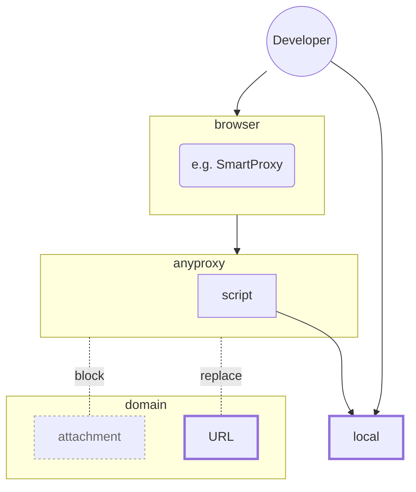

# Kintone Custom Devkit

## できること

 * apps/ 以下のアプリの一覧を自動生成
 * それぞれの app ごとのタスクを自動定義
    * lint
    * deploy
    * proxy
    * build ( 予定 )
    * test ( 予定 )

## 特徴

 * 複数のアプリのカスタマイズコードを効率的に集中管理しやすい
 * 開発中のコードを deploy することなく Kintone 環境に適用するための development proxy を持っており、運用を妨げず、かつ小さいサイクルでの開発を容易にする

## 準備

### 0. アプリを管理できるアカウント

開発する対象のアプリの管理権限のあるアカウントの username, password を取得しておくこと。つまり SSO でしかログインできないアカウントでは本ツールは利用できないので注意。

ただし**本ツールを利用して deploy しない場合は不要**。

Kintone の権限管理にはさまざまな方法があり、OAuth でも `@kintone/customize-uploader` は利用できるが、開発時、各種 API を叩く必要が出た場合など

**Kintoneの開発時の利用については結局パスワード認証が最強**

なので、SSO環境の場合は管理者と相談しパスワード認証を有効にしてもらう。

### 1. 環境変数

`.env` ファイルを用意し、以下の環境変数をセット

 * `KINTONE_BASE_URL`
 * `KINTONE_USERNAME`
 * `KINTONE_PASSWORD`

直接 deploy しない場合は `KINTONE_USERNAME`, `KINTONE_PASSWORD` は不要

### 2. deploy用のツールを別途global install

これも**本ツールで直接 deploy しない場合は不要**。

[@kintone/customize\-uploader \- npm](https://www.npmjs.com/package/@kintone/customize-uploader)

**@kintone/customize-uploader を global install してください**。

このツールは `@kintone/customize-uploader` を利用しているが、`@kintone/customize-uploader` は project 以下にインストールすると cwd の計算がどうしても project root になってしまう。この影響で customize manifest ファイルに含まれるパスも project root 以下からのものにせざるを得ない。

例えば以下のようにカスタマイズのコードを置いたとして

```
apps/ <- カスタマイズするアプリを置く場所
  アプリ1/
  アプリ2/
  ...
```

アプリ1の manifest は以下のファイルになるが、

`apps/アプリ1/customize-manifest.json`

この内容は以下のようになる。

```json
{
  "app": "アプリ1", <- 実際にはID(数字)
  "scope": "ALL",
  "desktop": {
    "js": [
      "apps/アプリ1/desktop/js/foobar.js", // <-
      ..
    ]
  }
}
```

これでは実際のディレクトリ構成と manifest ファイル内に二重に情報が保存されてしまって扱いにくいが、global install した場合はこのような問題は起きないので、global install で解決することとした。

### 3. ブラウザのproxyのセットアップ

development proxy として [alibaba/anyproxy: A fully configurable http/https proxy in NodeJS](https://github.com/alibaba/anyproxy) を利用している。開発中は Kintone の workspace への request を local proxy に向けることで開発中のコードを deploy することなく Kintone 環境に適用できる。

そのためブラウザの proxy 設定で

`KINTONE_BASE_URL` -> `localhost:8001`[^1]

へ向ける設定を行う。開発時には頻繁にこの設定を ON/OFF することになるので、何らかのブラウザ拡張の利用を推奨する。

[^1]: localhost:8001 は anyproxy のデフォルト

## Kintone Dev Proxyについて

### 目的

開発環境のコードのみをカスタマイズとして適用する。

 * production の attachment の読み込みを block （強制 404）
 * 開発用に追加した URL `https://kintone-dev.local` 以下は local のファイルを読み込む

これによって他のユーザーの環境に影響を与えずに開発者だけ開発途中のカスタマイズのコードを利用できる。

### 使い方

 1. 該当アプリの dev タスクを起動する
 2. ブラウザの proxy 設定で Kintone のワークススペースの URL への request を local proxy ( localhost:8001 ) へ向ける
 3. 開発中で適用したいコードがある場合は `https://kintone-dev.local` 以下の URL として該当アプリに追加

3 の URL は local の deploy に利用するファイルを参照するので、例えば

`https://kintone-dev.local/desktop/js/foobar.js`

をリンクとして「アプリ1」に追加した場合は、

```
apps/
  アプリ1/
    desktop/
      js/
        foobar.js
  アプリ2/
  ...
```

のような位置に適用したいファイルを置く。

### 構成



### 依存

 * [alibaba/anyproxy: A fully configurable http/https proxy in NodeJS](https://github.com/alibaba/anyproxy)
